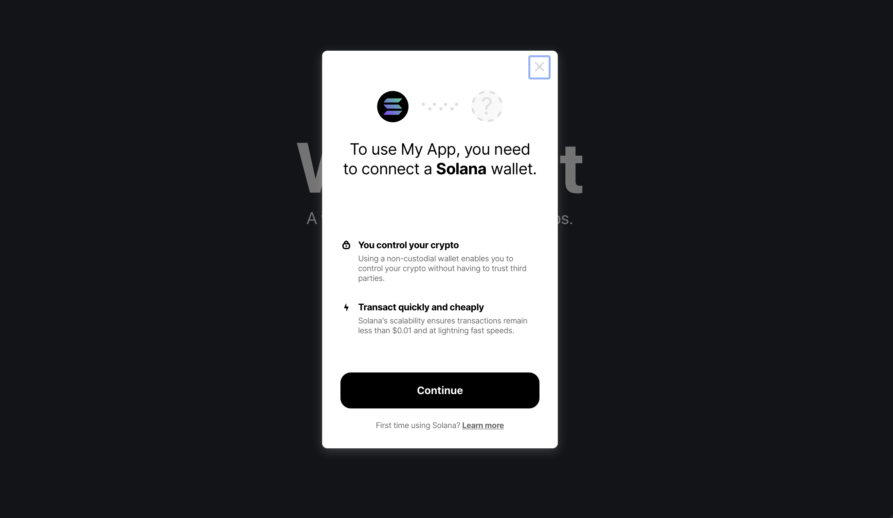

# reactjs web3 ecosystem

## connecting wallets
- [@gokiprotocol/walletkit](https://github.com/GokiProtocol/walletkit)

## UI components
- [chakra-ui](https://chakra-ui.com/guides/first-steps)

- [@saberhq/saber-common](https://github.com/saber-hq/saber-common)

## cloudflare
Cloudflare 是一个全球网络，旨在让您连接到互联网的一切都安全、私密、快速和可靠。

将您的 DNS 指向 Cloudflare，只需数分钟就能保护和加速您的应用程序、API 和网站。可瞬间开启性能和安全服务。

- [cloudflare](https://www.cloudflare.com/zh-cn/security/)