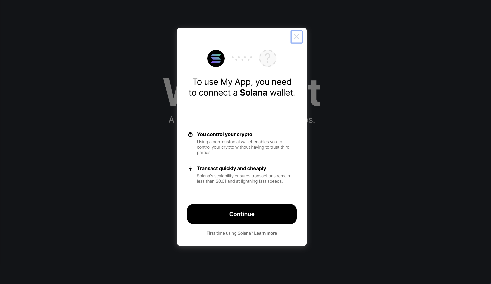

# reactjs web3 ecosystem

## connecting wallets
- [@gokiprotocol/walletkit](https://github.com/GokiProtocol/walletkit)


## UI components
- [chakra-ui](https://chakra-ui.com/guides/first-steps)

- [@saberhq/saber-common](https://github.com/saber-hq/saber-common)


## cloudflare
Cloudflare 是一个全球网络，旨在让您连接到互联网的一切都安全、私密、快速和可靠。

将您的 DNS 指向 Cloudflare，只需数分钟就能保护和加速您的应用程序、API 和网站。可瞬间开启性能和安全服务。

- [cloudflare](https://www.cloudflare.com/zh-cn/security/)

- [workers.dev](https://workers.cloudflare.com/)
- [ssc-dao.genesysgo.net](https://www.genesys.com/)
- [partyparrot.finance](https://staging.partyparrot.finance/mint/)
- [devnet.solana](https://api.devnet.solana.com/)


- [Serverless Progressive Web Apps using React with Cloudflare Workers](https://blog.cloudflare.com/serverless-pwa-react-cloudflare-workers/)

- [solscan](https://solscan.io/)
- [bunnyducky](https://bunnyducky.com/)

- [saber](https://saber.so/)
  - [@saberhq/use-solana]()


- [@solana/web3.js](https://github.com/solana-labs/solana-web3.js)

- [decimal.js](http://mikemcl.github.io/decimal.js/#)


- [zustand](https://github.com/pmndrs/zustand)
  - [zustand demo](https://zustand-demo.pmnd.rs/)
- [chakra ui](https://chakra-ui.com/)
- [emotion](https://github.com/emotion-js/emotion)
  - [emotion sh](https://emotion.sh/)


```
@emotion/react
@emotion/styled

@chakra-ui/icons
@chakra-ui/react

@orca-so/stablecurve

@saberhq/solana-contrib
@saberhq/anchor-contrib
@saberhq/merkle-distributor
@saberhq/token-utils
@saberhq/use-solana

@solana/buffer-layout
@solana/spl-token
@solana/spl-token-swap
@solana/wallet-adapter-base
@solana/web3.js

@gokiprotocol/walletkit

@jup-ag/react-hook

@parrotfi/core-sdk
@project-serum/associated-token

decimal.js
bignumber.js
dayjs

zustand
axios
framer-motion
node-xlsx

@testing-library/jest-dom
@testing-library/react
@testing-library/user-event

react
react-datasheet
react-dom
react-icons
react-router
react-router-dom
react-scripts
react-spinners
react-spring
react-virtualized-auto-sizer
react-window

typescript
web-vitals
```


## API

- [coingecko](https://www.coingecko.com/)
  - [coingecko api](https://www.coingecko.com/en/api/documentation)
