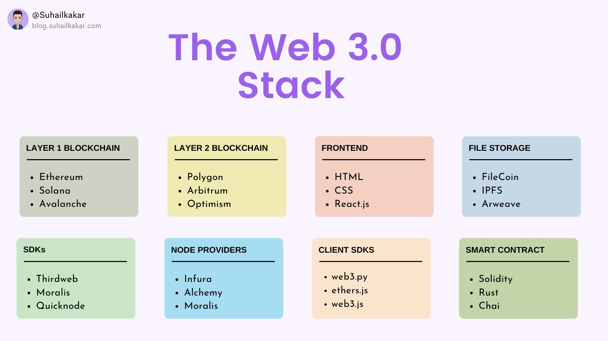

1/纳德达比特 ( 
@dabit3
 )

全栈 web3 开发的完整指南。创建 NFT mint 网站、NFT maketplace 和其他 dapp。
https://www.youtube.com/c/naderdabit

2/ 吃掉方块 ( 
@eattheblocks
 )

你会发现大量关于 Web3 / 区块链开发的高质量教程。它涵盖：
 - Eth & EVM 区块链
- Solidity 智能合约
- 去中心化应用程序（
 - DeFi 开发
- NFT 开发

https://www.youtube.com/c/EatTheBlocks

3/ Dapp大学（ 
@DappUniversity
 ）

学习在以太坊区块链上构建去中心化应用程序。

4/ Morallis Web3 ( 
@IvanOnTech
 )

这是所有 web3 程序员的频道。在这里，您可以向业内最有经验的开发人员学习有关 Ethereum、Polkadot、Cardano、BSC 等的技巧。

https://www.youtube.com/c/MoralisWeb3/featured

5/ 智能合约程序员（ 
@ProgrammerSmart
 ）

该频道提供有关开放去中心化区块链上的智能合约的免费教育。
学习 Solidity 语言

https://www.youtube.com/channel/UCJWh7F3AFyQ_x01VKzr9eyA/featured

6/帕特里克·柯林斯 ( 
@PatrickAlphaC
 )

了解智能合约、区块链、Defi、金融科技、Solidity、Python、Golang、Javascript。

https://www.youtube.com/c/PatrickCollins/featured

CSS • http://CSS-tricks.com
JavaScript • http://jsv9000.app
DOM • https://domevents.dev
Git & GitHub • http://LearnGitBranching.js.org
Next • http://nextjs.org/learn
API • http://rapidapi.com/guides
Web3 • http://useweb3.xyz

## The Web3 & Blockchain Stack  🚀

Layer 1 blockchain
➝ Ethereum
➝ Solana
➝ Avalanche

Frontend
➝ HTML
➝ CSS
➝ React.js

File Storage
➝ FileCoin
➝ IPFS
➝ Arweave

Node Providers
➝ Infura
➝ Moralis
➝ Alchemy 

Client SDKs
➝ web3. py (Python)
➝ ether.js 

Indexing/querying layer
➝ The Graph

